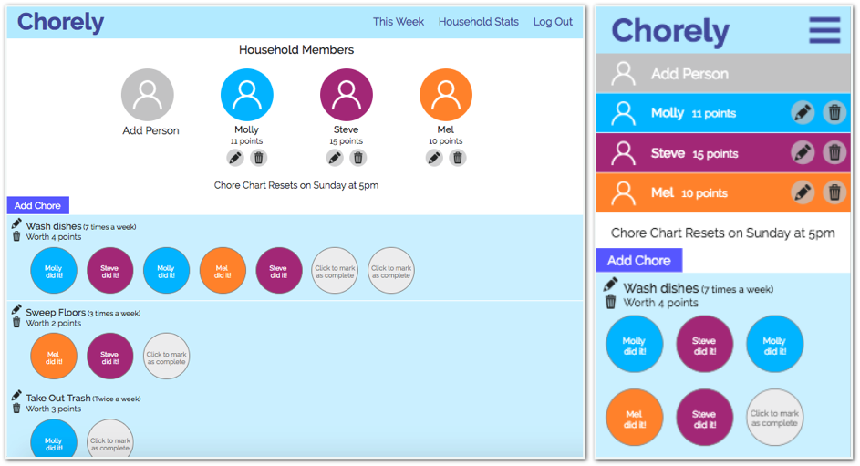

# Chorely

A responsive web app that gamifies household chores and creates a visual record or who's doing what. Built with React and Redux. Work in progress. See a live demo [here](https://chorely.netlify.com/).

This project was bootstrapped with [Create React App](https://github.com/facebookincubator/create-react-app). Chorely's server side code (built with Node.js and MongoDB) can be found in [this repository.](https://github.com/MollyJeanB/ChorelyApp-api)

## Introduction

Whether you live with roommates, family members, or a pack of woodland gnomes, one of the most challenging things about sharing a living space is figuring out how to divvy up the household chores. Chorely is a simple, visual chore chart app that shows who's doing what awards points to chore heroes.

## Technology

### Front End

* React.js
* Redux
* Testing with [Enzyme](http://airbnb.io/enzyme/docs/api/)
* CSS Modules
* Continuous integration and deployment with [Travis CI](https://travis-ci.org/)

### Back End
View server code [this repository.](https://github.com/MollyJeanB/ChorelyApp-api)

* Node.js + Express.js (web server)
* MongoDB (database)
* [Mocha](https://mochajs.org/) + [Chai](http://www.chaijs.com/) (testing)
* JSON Web Tokens (user authentication)

## Future Features

* Household stats tracking: pie charts shows who's doing which chores the most often
* Weekly chart reset: clears out the chore completions and weekly score (overall score to be retained in the stats section)
* Text and email reminders for household members

## Attribution

* Chore icons by [Surang](https://www.flaticon.com/authors/surang) via [Flaticon](https://www.flaticon.com/).

* House icon by [Smashicons](https://www.flaticon.com/authors/smashicons) via Flaticon.

* Chart loading indicator by [Tobias Sahlin](http://tobiasahlin.com/spinkit/)

* Pie charts created with [react-svg-piechart](https://github.com/xuopled/react-svg-piechart)
